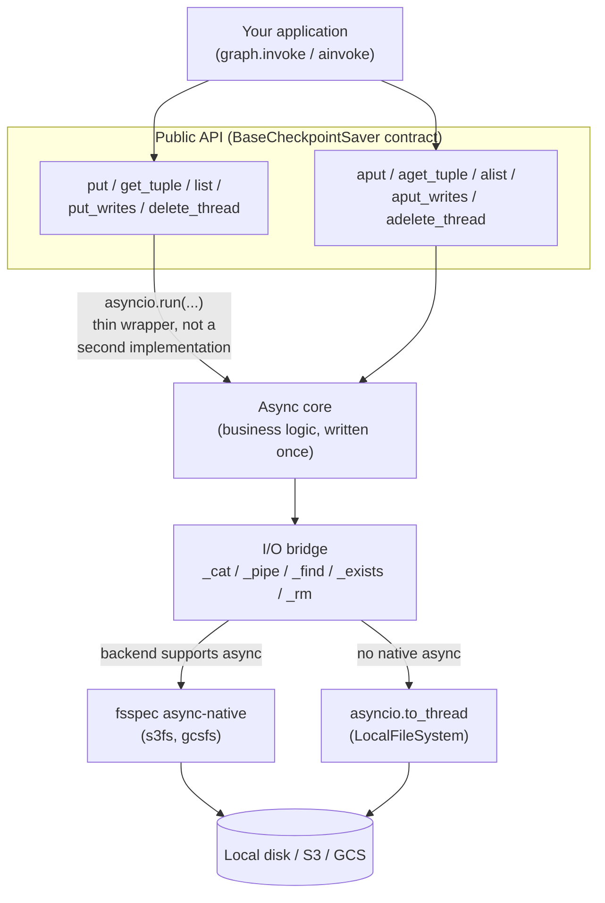
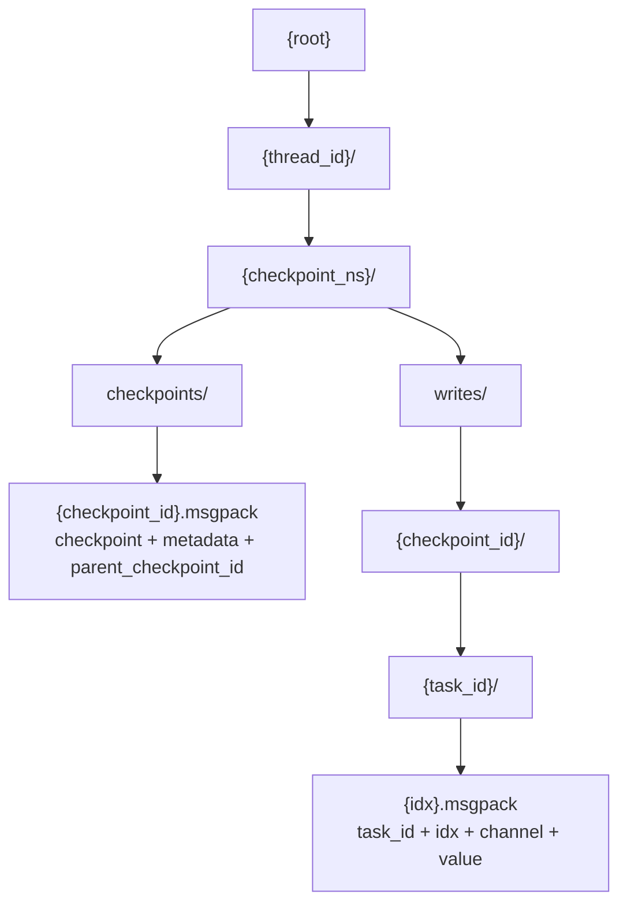

# langgraph-checkpoint-objectstorage

[](https://github.com/sergiommarcial/langgraph-objectstorage-checkpoint/actions/workflows/ci.yml)
[](.github/workflows/ci.yml)
[](https://pypi.org/project/langgraph-checkpoint-objectstorage/)
[](https://pypi.org/project/langgraph-checkpoint-objectstorage/)
[](LICENSE)
[](https://pypi.org/project/langgraph-checkpoint-objectstorage/)

A [LangGraph](https://github.com/langchain-ai/langgraph) `BaseCheckpointSaver`
that persists checkpoints to local filesystem, Google Cloud Storage, or AWS
S3. One class, backend picked by connection string, nothing to run beyond a
bucket (or a directory).

**Most checkpoint savers make you run a database. This one just needs a
bucket you probably already have.**

## Table of contents

- [Features](#features)
- [Requirements](#requirements)
- [Install](#install)
- [Quickstart](#-quickstart)
- [Examples](#examples)
- [Choosing a backend](#choosing-a-backend)
- [Checkpoint TTL](#-checkpoint-ttl)
- [Compression](#-compression)
- [Encryption](#-encryption)
- [Architecture](#architecture)
- [Architecture decision records](#architecture-decision-records)
- [Runtime type checking](#runtime-type-checking)
- [Logging](#logging)
- [Known limitations](#known-limitations)
- [Performance](#-performance)
- [Development](#development)
- [Contributing](#contributing)
- [License](#license)

## Features

- `ObjectStorageSaver.from_conn_string(...)` picks local disk, GCS, or S3
  from the URI scheme. No per-backend subclasses.
- Full sync and async support: every `BaseCheckpointSaver` method, both
  flavors (`get_tuple`/`aget_tuple`, `put`/`aput`, `list`/`alist`,
  `put_writes`/`aput_writes`, `delete_thread`/`adelete_thread`).
- Tested against the official contract with
  [`langgraph-checkpoint-conformance`](https://pypi.org/project/langgraph-checkpoint-conformance/)
  on all three backends, not just hand-written assertions.
- Runtime type checking on the public API via
  [typeguard](https://typeguard.readthedocs.io/) catches wrong-argument-type
  mistakes at the call site.
- Ships `py.typed` for full static type coverage under mypy/pyright.
- No database or extra service required in production, just object storage.

> [!NOTE]
> **Best for:** apps already living in S3/GCS/local disk that don't want a
> database in the loop just for checkpointing, or that need checkpoints to
> land in the same bucket as everything else they store.
>
> **Not for:** workloads needing transactional guarantees across
> checkpoints, or heavy concurrent writes to the *same* thread from
> multiple writers -- see [Known limitations](#known-limitations). For
> those, the official `langgraph-checkpoint-postgres` saver is the better
> fit.

### vs. the official savers

|                          | This saver                      | `-sqlite` / `-postgres` |
|--------------------------|----------------------------------|--------------------------|
| Infra to run             | None -- a bucket or a directory | A database server        |
| Backend                  | Local disk, S3, or GCS           | SQLite or Postgres        |
| `put`/`put_writes` model | Each call writes a new object    | Row inserts               |
| `list(filter=...)`       | Client-side (see [Known limitations](#known-limitations)) | Pushed to SQL |
| Retention                | TTL via bucket lifecycle rules, or `delete_expired()` | Up to you |

If you'd rather not run a database just to remember where a graph left off,
this is that option.

## Requirements

Python 3.11+.

## Install

```bash
pip install langgraph-checkpoint-objectstorage        # local filesystem only
pip install "langgraph-checkpoint-objectstorage[s3]"   # + AWS S3
pip install "langgraph-checkpoint-objectstorage[gcs]"  # + Google Cloud Storage
pip install "langgraph-checkpoint-objectstorage[compression]"  # + zstd codec
```

## ⚡ Quickstart

```python
from langgraph.graph import END, START, StateGraph
from langgraph_checkpoint_objectstorage import ObjectStorageSaver


def increment(state: dict) -> dict:
    return {"count": state["count"] + 1}


builder = StateGraph(dict)
builder.add_node("increment", increment)
builder.add_edge(START, "increment")
builder.add_edge("increment", END)

saver = ObjectStorageSaver.from_conn_string("file:///tmp/checkpoints")
graph = builder.compile(checkpointer=saver)

config = {"configurable": {"thread_id": "1"}}
result = graph.invoke({"count": 0}, config)
print(result)  # {"count": 1}

# Checkpoints persisted under the thread survive process restarts.
# Inspect or resume from the same thread_id at any later point:
history = list(graph.get_state_history(config))
```

## Examples

This same quickstart, runnable under three build tools:

- [`examples/pip`](examples/pip): venv + `pip install -r requirements.txt`
- [`examples/uv/filesystem`](examples/uv/filesystem): `uv run main.py`
- [`examples/poetry/filesystem`](examples/poetry/filesystem): `poetry install && poetry run python main.py`

Each installs the package from this repo via a local path dependency
(swap for a normal PyPI dependency once the package is published).

For object storage instead of local disk (a real bucket or a local
emulator, no cloud account needed), there are examples for both S3 and
GCS: multiple independent sessions running sequentially with one resumed
later, and the same pattern again run concurrently via the async API.

- [`examples/uv/s3`](examples/uv/s3) / [`examples/uv/s3-async`](examples/uv/s3-async)
- [`examples/poetry/gcs`](examples/poetry/gcs) / [`examples/poetry/gcs-async`](examples/poetry/gcs-async)

Sequential and concurrent are separate examples rather than one combined
script, see [Known limitations](#known-limitations) for why.

For [compression](#-compression): [`examples/uv/compression`](examples/uv/compression)
writes the same checkpoint with and without it, and prints the size
difference on disk.

For [encryption](#-encryption): [`examples/uv/encryption`](examples/uv/encryption)
writes the same checkpoint with and without it, and checks whether a known
plaintext value shows up in the raw object on disk either way.

## Choosing a backend

Swap the connection string; everything else stays the same.

```python
from langgraph_checkpoint_objectstorage import ObjectStorageSaver

# Local filesystem: handy for development, or single-node deployments
saver = ObjectStorageSaver.from_conn_string("file:///var/lib/my-app/checkpoints")

# Google Cloud Storage
saver = ObjectStorageSaver.from_conn_string("gcs://my-bucket/checkpoints")

# AWS S3
saver = ObjectStorageSaver.from_conn_string("s3://my-bucket/checkpoints")
```

`from_conn_string` forwards extra keyword arguments to the underlying
[fsspec](https://filesystem-spec.readthedocs.io/) filesystem constructor.
Useful for explicit credentials, non-default regions, or S3-compatible
endpoints (MinIO, Cloudflare R2, etc.):

```python
saver = ObjectStorageSaver.from_conn_string(
    "s3://my-bucket/checkpoints",
    key="...",
    secret="...",
    client_kwargs={"endpoint_url": "https://minio.internal:9000"},
)
```

Credentials otherwise follow each backend's normal resolution: AWS's usual
chain (env vars, `~/.aws/credentials`, instance/task role) for S3,
Application Default Credentials for GCS. There's nothing library-specific
to configure beyond the connection string.

## ⏳ Checkpoint TTL

Pass `ttl` to bound how long checkpoints and writes stick around:

```python
from datetime import timedelta

saver = ObjectStorageSaver.from_conn_string(
    "s3://my-bucket/checkpoints",
    ttl=timedelta(days=30),
)
```

`ttl=None` (the default) turns TTL off completely: nothing expires on its
own, exactly like before this option existed. Setting `ttl` logs a
one-time `WARNING` on construction as a reminder that the saver itself
never deletes anything -- there's no way for it to check whether a bucket
lifecycle rule actually exists, so it just tells you what to go set up.

**Local filesystem** has no built-in expiry, so you call `delete_expired()`
(or `adelete_expired()`) yourself on a schedule (cron, k8s CronJob, ...):

```python
saver.delete_expired()  # deletes everything older than `ttl`
```

**S3 and GCS** don't need `delete_expired()` at all if you configure a
bucket lifecycle rule against the saver's `root` prefix. The cloud provider
then expires objects on its own schedule (typically once a day), with no
saver code involved. `ttl` still documents the intended age; keeping the
bucket rule's age in sync with it is on you.

S3 lifecycle rule (filtered by `root`, e.g. `"checkpoints/"`):

```json
{
  "Rules": [
    {
      "ID": "expire-checkpoints",
      "Filter": {"Prefix": "checkpoints/"},
      "Status": "Enabled",
      "Expiration": {"Days": 30}
    }
  ]
}
```

GCS lifecycle rule (same idea, via `gsutil` or the console):

```json
{
  "rule": [
    {
      "action": {"type": "Delete"},
      "condition": {"age": 30, "matchesPrefix": ["checkpoints/"]}
    }
  ]
}
```

`delete_expired()`/`adelete_expired()` also work against S3/GCS-backed
savers. They're useful before a lifecycle rule is set up, or when you want
deletion faster than the cloud provider's own cadence.

> [!WARNING]
> **Sharing a bucket with other data?** Always end the lifecycle rule's
> prefix with `/`, exactly as in the examples above. S3's `Filter.Prefix`
> and GCS's `matchesPrefix` do a literal string match with no concept of
> where a path actually ends, so `"Prefix": "checkpoints"` without the
> trailing slash also matches `checkpoints-backup/...` or
> `checkpoints-v2/...`, quietly expiring unrelated data that happens to sit
> next to this saver's `root`. That risk is specific to the lifecycle rule
> you configure by hand, though: `delete_expired()` itself treats `root` as
> a real directory path, not a raw prefix, so it doesn't have this problem.

## 🗜️ Compression

Pass `compression` to shrink checkpoint and write objects before upload:

```python
saver = ObjectStorageSaver.from_conn_string(
    "s3://my-bucket/checkpoints",
    compression="lzma",
)
# or inline in the connection string:
saver = ObjectStorageSaver.from_conn_string(
    "s3://my-bucket/checkpoints?compression=lzma"
)
```

`compression="none"` (the default) is byte-identical to every release
before this option existed -- nothing changes unless you opt in. Accepted
values:

- `"none"` -- no compression (default).
- `"zlib"` / `"lzma"` -- standard library, no extra dependency. `lzma`
  compresses smaller but slower than `zlib`.
- `"zstd"` -- faster than both at a comparable or better ratio, but needs
  the `compression` extra
  (`pip install "langgraph-checkpoint-objectstorage[compression]"`).
  Requesting it without the extra installed raises `ImportError`
  immediately at construction, not on the next `put`/`get_tuple`.

Every object records its own codec, so changing `compression` between
deploys of the same application is safe: old objects stay readable under
whichever codec wrote them, new objects use the new one, and a bucket can
mix codecs indefinitely with no migration step.

Worth enabling for threads with large, compressible state (accumulated
message history, JSON-like tool outputs); skip it for small checkpoints or
already-compressed/high-entropy values (embeddings, binary blobs), where
compression buys little and can even net-expand tiny payloads.
Compression runs synchronously on the event loop -- see
[ADR 0003](docs/adr/0003-checkpoint-compression.md) for the tradeoff.
Compressed objects also lose the plain-`cat`/`aws s3 cp` inspectability
uncompressed objects have.

## 🔒 Encryption

Pass `encryption` with a `KeyProvider` implementation to encrypt checkpoint
and write objects with AES-256-GCM before upload:

```python
class MyKeyProvider:
    def get_key(self, thread_id: str, key_id: str | None = None) -> tuple[str, bytes]:
        # key_id=None means "give me the current key to encrypt with";
        # a specific key_id means "resolve exactly this historical key
        # to decrypt with" -- wire up your KMS/Vault/static-key lookup here.
        return "k1", my_32_byte_key

saver = ObjectStorageSaver.from_conn_string(
    "s3://my-bucket/checkpoints",
    encryption=MyKeyProvider(),
)
```

`encryption=None` (the default) is byte-identical to every release before
this option existed -- nothing changes unless you opt in. Requires the
`encryption` extra
(`pip install "langgraph-checkpoint-objectstorage[encryption]"`).
Requesting it without the extra installed raises `ImportError` immediately
at construction.

Every object records its own `key_id`, so rotating to a new key doesn't
require migrating existing objects -- as long as your `KeyProvider` can
still resolve every `key_id` it has ever issued. A single-key provider
that ignores `key_id` and always returns the same key is a valid, minimal
implementation if you don't need rotation.

The AEAD's associated data is bound to the object's full storage identity:
`thread_id`, `checkpoint_ns`, and `checkpoint_id` for a checkpoint, plus
`task_id` and the write index for a pending write. Move an object to a
different thread, namespace, checkpoint, task, or write index and it
fails to decrypt, instead of silently decrypting under whatever key that
new path resolves to. Once `encryption` is configured, reading an object
that was never encrypted is also an error, not a silent pass-through.

> [!NOTE]
> Encryption here is symmetric AEAD (AES-256-GCM) only -- there's no
> direct asymmetric (RSA/ECIES) payload encryption, since no real system
> encrypts bulk data that way. Asymmetric key *management* (an RSA- or
> KMS-wrapped data key) is still fully supported: it's entirely contained
> inside your `KeyProvider` implementation, which the library treats as
> opaque.

> [!WARNING]
> This only encrypts payload bytes. Object paths still encode `thread_id`,
> `checkpoint_ns`, `checkpoint_id`, and task/channel names in plaintext --
> anyone with bucket read access still sees thread activity patterns and
> checkpoint cadence. Losing your `KeyProvider`'s ability to resolve a
> `key_id` makes every object written under that key permanently
> unreadable; there's no recovery path inside this library. See
> [ADR 0004](docs/adr/0004-checkpoint-encryption.md) for the full design
> and tradeoffs.

## Architecture

Business logic (key layout, filtering, ordering, idempotency) is written
once, as async methods. The public sync API is a thin `asyncio.run(...)`
wrapper around that same async core, not a second implementation, so
there's a single source of truth per operation instead of sync and async
code drifting apart. An I/O bridge picks native async calls when the
backend supports them (`s3fs`, `gcsfs`) and falls back to
`asyncio.to_thread` when it doesn't (local disk):



Each checkpoint and each write becomes its own object: no read-modify-write
on existing keys, so concurrent writers on different threads never race,
and a `put` or `put_writes` call is always a single write:



Key technical decisions this reflects:

- `checkpoint_id` is LangGraph's own [uuid6](https://github.com/langchain-ai/langgraph/blob/main/libs/checkpoint/langgraph/checkpoint/base/id.py),
  already time-sortable, so `list()`'s newest-first ordering falls out of a
  plain key sort, with no secondary index to keep in sync.
- Checkpoints and metadata are serialized through LangGraph's own
  `JsonPlusSerializer` and treated as opaque: never hand-extracted field by
  field, since real LangGraph objects carry fields their own TypedDicts
  don't declare (see [Runtime type checking](#runtime-type-checking)).
- `put_writes`' overwrite-vs-ignore split ("first write wins" for regular
  channels, always-replace for the control channels `ERROR`/`SCHEDULED`/
  `INTERRUPT`/`RESUME`) mirrors the official sqlite/postgres savers exactly.
- `list(filter=...)` is deliberately client-side, not an oversight: object
  storage has no query engine to push a filter into. See
  [Known limitations](#known-limitations).

## Architecture decision records

Design proposals and decisions that change or extend the architecture
above live under [`docs/adr/`](docs/adr/), not in this README:

- [`0001-checkpoint-ttl.md`](docs/adr/0001-checkpoint-ttl.md) on why TTL enforcement is
backend-specific instead of one mechanism for all three.
- [`0002-slatedb.md`](docs/adr/0002-slatedb.md) --
  proposal for an opt-in SlateDB-backed storage mode to bound
  `get_tuple(latest)`/`list()` cost on threads with very large checkpoint
  histories (see [Known limitations](#known-limitations)). Status:
  proposed, not implemented.
- [`0003-checkpoint-compression.md`](docs/adr/0003-checkpoint-compression.md)
  on the pluggable codec registry and wire format behind the
  `compression` option.
- [`0004-checkpoint-encryption.md`](docs/adr/0004-checkpoint-encryption.md)
  on the `KeyProvider` protocol and AES-256-GCM wire format behind the
  `encryption` option.
- [`0005-performance-benchmarks.md`](docs/adr/0005-performance-benchmarks.md)
  on the pytest-benchmark suite, its backend/envelope/scale matrix, and why
  CI regression gating and load testing are deferred.

## Runtime type checking

Public methods are decorated with [typeguard](https://typeguard.readthedocs.io/)
and raise `typeguard.TypeCheckError` on a call with the wrong argument
types (e.g. a non-string `thread_id`, a `writes` argument that isn't a
sequence of `(channel, value)` pairs). This catches integration mistakes
at the call site instead of letting them corrupt stored data silently.

`config`, `checkpoint`, and `metadata` arguments are intentionally *not*
strictly checked against LangGraph's `RunnableConfig`/`Checkpoint`/
`CheckpointMetadata` TypedDicts: real LangGraph objects don't match those
TypedDicts exactly (a real `RunnableConfig`'s `metadata` field is a
`collections.ChainMap`, not a plain `dict`; real checkpoints carry fields
like the legacy `pending_sends` key that isn't declared at all), and strict
checking would reject every real invocation. The same logic applies to
`get_tuple`/`list`'s return value, which also isn't runtime-checked. Other
arguments (`thread_id`, `task_id`, `writes`, `limit`, ...) are checked
normally.

## Logging

Uses standard `logging` under the logger name
`langgraph_checkpoint_objectstorage`. No handlers are configured, so it
stays silent until your application's logging config says otherwise.

For quick debugging, set `LANGGRAPH_CHECKPOINT_OBJECTSTORAGE_LOG_LEVEL=DEBUG`
before constructing an `ObjectStorageSaver`. It emits one DEBUG line per
storage read/write/list with the key or prefix touched.

## Known limitations

- `list(filter=...)` is client-side: every checkpoint in the thread/namespace
  is fetched and filtered in Python, since object storage has no query
  engine to push the filter into. Fine for typical thread histories (dozens
  to low hundreds of checkpoints); a very long-running thread's `list` calls
  will get proportionally slower.
- `get_tuple` without an explicit `checkpoint_id` (resolving "latest") pays
  the same cost: it lists every checkpoint key under the thread/namespace to
  find the newest one. Since this runs on every resume of an existing
  thread, a thread with a very large checkpoint history will see resume
  latency grow with checkpoint count, not just `list()` calls. See
  [`docs/adr/0001-slatedb.md`](docs/adr/0001-slatedb.md)
  for a proposed fix (currently a design proposal, not yet implemented).
- TTL is per-object age, not per-checkpoint-chain: a checkpoint's `writes`
  objects are added later (via `put_writes`) and age out on their own
  clock, so they can expire slightly before or after the checkpoint they
  belong to. There's no read-time filtering either: an object past its TTL
  is still returned by `get_tuple`/`list` until something actually deletes
  it (a lifecycle rule run, or a `delete_expired()` call). See
  [Checkpoint TTL](#checkpoint-ttl).
- Two writers on the *same* `thread_id` writing concurrently can race, at
  the same guarantee level as the official sqlite saver (last write "wins"
  by whichever checkpoint_id sorts last, not by wall-clock order under
  clock skew). Concurrent writers on different threads never race.
- The sync `list()` eagerly collects all matching checkpoints before
  yielding the first one (it wraps the async implementation via
  `asyncio.run`, which can't stream lazily). Use `alist()` from async code
  if you need true streaming.

> [!WARNING]
> Don't mix sync and async calls on the *same* `ObjectStorageSaver`
> instance against S3 or GCS. Sync calls run on a persistent background
> loop the underlying filesystem maintains; async calls run on whichever
> loop the caller provides. The aiohttp session those backends use can
> only belong to one loop at a time, so alternating between the two on one
> instance breaks with `RuntimeError: ... attached to a different loop`.
> Build a separate saver instance per usage style instead (see
> `examples/uv/s3` vs `examples/uv/s3-async`, or `examples/poetry/gcs` vs
> `examples/poetry/gcs-async`). Local filesystem isn't affected: it has no
> persistent session to misalign.

## 📊 Performance

<!-- BENCHMARK-RESULTS:START -->
| Operation | Backend | Dimension | Mean (µs) | StdDev (µs) | Ops/sec | Notes |
|---|---|---|---|---|---|---|
| delete_thread | local | history_size=10 | 469.06 | 20.73 | 2131.9 | [ADR 0006](docs/adr/0006-persistent-event-loop.md) |
| delete_thread | local | history_size=100 | 2389.45 | 62.71 | 418.5 | [ADR 0006](docs/adr/0006-persistent-event-loop.md) |
| delete_thread | local | history_size=1000 | 29951.57 | 403.19 | 33.4 | [ADR 0006](docs/adr/0006-persistent-event-loop.md) |
| delete_thread | s3 | history_size=10 | 6726.01 | 3848.76 | 148.7 |  |
| delete_thread | s3 | history_size=100 | 16841.60 | 5085.77 | 59.4 |  |
| delete_thread | s3 | history_size=1000 | 120670.05 | 3387.40 | 8.3 |  |
| put | local | envelope=plain | 174.88 | 68.00 | 5718.2 | [ADR 0006](docs/adr/0006-persistent-event-loop.md) |
| put | local | envelope=compression | 174.43 | 14.15 | 5732.9 | [ADR 0006](docs/adr/0006-persistent-event-loop.md) |
| put | local | envelope=encryption | 204.27 | 13.26 | 4895.4 | [ADR 0006](docs/adr/0006-persistent-event-loop.md) |
| put | s3 | envelope=plain | 2640.22 | 109.97 | 378.8 |  |
| put | s3 | envelope=compression | 2616.59 | 74.97 | 382.2 |  |
| put | s3 | envelope=encryption | 2701.21 | 158.98 | 370.2 |  |
| get_tuple | local | envelope=plain | 186.55 | 13.04 | 5360.5 | [ADR 0006](docs/adr/0006-persistent-event-loop.md) |
| get_tuple | local | envelope=compression | 190.44 | 14.10 | 5251.1 | [ADR 0006](docs/adr/0006-persistent-event-loop.md) |
| get_tuple | local | envelope=encryption | 215.03 | 14.88 | 4650.6 | [ADR 0006](docs/adr/0006-persistent-event-loop.md) |
| get_tuple | s3 | envelope=plain | 6683.05 | 289.84 | 149.6 |  |
| get_tuple | s3 | envelope=compression | 6684.86 | 414.28 | 149.6 |  |
| get_tuple | s3 | envelope=encryption | 6880.38 | 233.57 | 145.3 |  |
| put_writes | local | envelope=plain | 152.53 | 23.85 | 6556.0 | [ADR 0006](docs/adr/0006-persistent-event-loop.md) |
| put_writes | local | envelope=compression | 158.87 | 12.73 | 6294.5 | [ADR 0006](docs/adr/0006-persistent-event-loop.md) |
| put_writes | local | envelope=encryption | 186.30 | 13.62 | 5367.6 | [ADR 0006](docs/adr/0006-persistent-event-loop.md) |
| put_writes | s3 | envelope=plain | 2550.23 | 89.27 | 392.1 |  |
| put_writes | s3 | envelope=compression | 2533.29 | 422.45 | 394.7 |  |
| put_writes | s3 | envelope=encryption | 2661.21 | 393.69 | 375.8 |  |
| put | local | envelope=plain, payload_size=small | 174.48 | 48.52 | 5731.4 | [ADR 0006](docs/adr/0006-persistent-event-loop.md) |
| put | local | envelope=plain, payload_size=medium | 169.98 | 13.45 | 5883.0 | [ADR 0006](docs/adr/0006-persistent-event-loop.md) |
| put | local | envelope=plain, payload_size=large | 292.62 | 168.14 | 3417.4 | [ADR 0006](docs/adr/0006-persistent-event-loop.md) |
| put | local | envelope=compression, payload_size=small | 175.05 | 12.13 | 5712.8 | [ADR 0006](docs/adr/0006-persistent-event-loop.md) |
| put | local | envelope=compression, payload_size=medium | 181.75 | 22.93 | 5502.2 | [ADR 0006](docs/adr/0006-persistent-event-loop.md) |
| put | local | envelope=compression, payload_size=large | 333.08 | 22.86 | 3002.3 | [ADR 0006](docs/adr/0006-persistent-event-loop.md) |
| put | local | envelope=encryption, payload_size=small | 206.97 | 16.99 | 4831.7 | [ADR 0006](docs/adr/0006-persistent-event-loop.md) |
| put | local | envelope=encryption, payload_size=medium | 205.11 | 15.05 | 4875.5 | [ADR 0006](docs/adr/0006-persistent-event-loop.md) |
| put | local | envelope=encryption, payload_size=large | 462.13 | 625.71 | 2163.9 | [ADR 0006](docs/adr/0006-persistent-event-loop.md) |
| put | s3 | envelope=plain, payload_size=small | 2608.71 | 104.19 | 383.3 |  |
| put | s3 | envelope=plain, payload_size=medium | 2827.90 | 317.61 | 353.6 |  |
| put | s3 | envelope=plain, payload_size=large | 6326.03 | 778.58 | 158.1 |  |
| put | s3 | envelope=compression, payload_size=small | 2606.16 | 96.02 | 383.7 |  |
| put | s3 | envelope=compression, payload_size=medium | 2619.20 | 134.76 | 381.8 |  |
| put | s3 | envelope=compression, payload_size=large | 2694.78 | 82.62 | 371.1 |  |
| put | s3 | envelope=encryption, payload_size=small | 2795.94 | 212.95 | 357.7 |  |
| put | s3 | envelope=encryption, payload_size=medium | 2716.96 | 104.17 | 368.1 |  |
| put | s3 | envelope=encryption, payload_size=large | 6609.88 | 959.95 | 151.3 |  |
| get_tuple | local | envelope=plain, payload_size=small | 184.86 | 16.59 | 5409.5 | [ADR 0006](docs/adr/0006-persistent-event-loop.md) |
| get_tuple | local | envelope=plain, payload_size=medium | 183.06 | 14.88 | 5462.7 | [ADR 0006](docs/adr/0006-persistent-event-loop.md) |
| get_tuple | local | envelope=plain, payload_size=large | 250.36 | 16.29 | 3994.3 | [ADR 0006](docs/adr/0006-persistent-event-loop.md) |
| get_tuple | local | envelope=compression, payload_size=small | 185.16 | 14.53 | 5400.9 | [ADR 0006](docs/adr/0006-persistent-event-loop.md) |
| get_tuple | local | envelope=compression, payload_size=medium | 190.57 | 29.68 | 5247.5 | [ADR 0006](docs/adr/0006-persistent-event-loop.md) |
| get_tuple | local | envelope=compression, payload_size=large | 283.14 | 17.03 | 3531.9 | [ADR 0006](docs/adr/0006-persistent-event-loop.md) |
| get_tuple | local | envelope=encryption, payload_size=small | 213.79 | 22.68 | 4677.5 | [ADR 0006](docs/adr/0006-persistent-event-loop.md) |
| get_tuple | local | envelope=encryption, payload_size=medium | 215.84 | 18.63 | 4633.0 | [ADR 0006](docs/adr/0006-persistent-event-loop.md) |
| get_tuple | local | envelope=encryption, payload_size=large | 404.59 | 25.04 | 2471.6 | [ADR 0006](docs/adr/0006-persistent-event-loop.md) |
| get_tuple | s3 | envelope=plain, payload_size=small | 6656.15 | 193.53 | 150.2 |  |
| get_tuple | s3 | envelope=plain, payload_size=medium | 6820.87 | 1296.53 | 146.6 |  |
| get_tuple | s3 | envelope=plain, payload_size=large | 8738.42 | 164.89 | 114.4 |  |
| get_tuple | s3 | envelope=compression, payload_size=small | 6797.83 | 1321.62 | 147.1 |  |
| get_tuple | s3 | envelope=compression, payload_size=medium | 6631.35 | 148.86 | 150.8 |  |
| get_tuple | s3 | envelope=compression, payload_size=large | 7015.01 | 1485.27 | 142.6 |  |
| get_tuple | s3 | envelope=encryption, payload_size=small | 6889.02 | 282.16 | 145.2 |  |
| get_tuple | s3 | envelope=encryption, payload_size=medium | 8853.58 | 14973.55 | 112.9 |  |
| get_tuple | s3 | envelope=encryption, payload_size=large | 9155.68 | 1494.45 | 109.2 |  |
| get_tuple_latest | local | history_size=10 | 212.65 | 14.26 | 4702.6 | [ADR 0006](docs/adr/0006-persistent-event-loop.md) |
| get_tuple_latest | local | history_size=100 | 478.30 | 22.23 | 2090.8 | [ADR 0006](docs/adr/0006-persistent-event-loop.md) |
| get_tuple_latest | local | history_size=1000 | 3018.62 | 89.10 | 331.3 | [ADR 0006](docs/adr/0006-persistent-event-loop.md) |
| get_tuple_latest | s3 | history_size=10 | 8032.48 | 1412.90 | 124.5 |  |
| get_tuple_latest | s3 | history_size=100 | 16024.56 | 1535.72 | 62.4 |  |
| get_tuple_latest | s3 | history_size=1000 | 99254.45 | 33323.66 | 10.1 |  |
| list_filter | local | history_size=10 | 709.50 | 229.21 | 1409.4 | [ADR 0006](docs/adr/0006-persistent-event-loop.md) |
| list_filter | local | history_size=100 | 5174.76 | 466.95 | 193.2 | [ADR 0006](docs/adr/0006-persistent-event-loop.md) |
| list_filter | local | history_size=1000 | 52266.19 | 1050.01 | 19.1 | [ADR 0006](docs/adr/0006-persistent-event-loop.md) |
| list_filter | s3 | history_size=10 | 19705.82 | 541.82 | 50.7 |  |
| list_filter | s3 | history_size=100 | 145612.52 | 2577.41 | 6.9 |  |
| list_filter | s3 | history_size=1000 | 1452278.36 | 50613.10 | 0.7 |  |

_Measured on 2026-09-05, on maintainer hardware against local disk and an in-process moto S3 emulator -- a relative comparison across operations/backends/envelopes, not an absolute production guarantee._
<!-- BENCHMARK-RESULTS:END -->

Each row is one operation, run repeatedly under one condition. `Dimension`
says what's varied: `envelope=` is the compression/encryption setting
(see [Compression](#-compression), [Encryption](#-encryption)),
`history_size=` is how many checkpoints already existed in the thread
being read from, written to, or deleted. A bigger history makes
`delete_thread` and the two O(n) costs above slower; it doesn't affect a
plain `put`/`get_tuple`/`put_writes` on a single checkpoint.

`Mean` and `StdDev` are the average time per call and how much that time
varied across runs, in microseconds (1,000 µs = 1 ms) -- a StdDev that's
large relative to the mean means the operation's cost is inconsistent,
not just slow. `Ops/sec` is the same mean turned into "calls per second"
(1,000,000 / mean µs), which is often easier to compare across rows at a
glance.

`s3` rows are against an in-process moto emulator, not real AWS S3. Fine
for comparing operations, backends, and envelopes against each other; not
a real-network latency estimate.

`Notes` links to the ADR responsible for a row's numbers, when one
applies. Every `local` row currently points to
[ADR 0006](docs/adr/0006-persistent-event-loop.md): all local-disk sync
calls share the same persistent background event loop it introduced, so
that one change touches every operation on that backend, not just a
specific one.

Benchmarks cover the hot path (`put`/`get_tuple`/`put_writes`), the
documented O(n) costs above (`list(filter=...)`, `get_tuple(latest)`) at a
few thread-history sizes, payload-size scaling, and `delete_thread` at
scale, across local disk and an in-process moto S3 emulator, with plain,
compressed, and encrypted envelopes. See
[`docs/adr/0005-performance-benchmarks.md`](docs/adr/0005-performance-benchmarks.md)
for the full design. Run them yourself with `make bench` (or
`make bench-compare` / `make bench-report` -- see
[Development](#development)).

## Development

```bash
make install        # sync deps into an isolated .venv (installs uv if missing)
make lint             # black --check, pyflakes, bandit, vulture -- runs before test/build
make format          # apply black formatting in place
make test            # full suite -- docker-compose integration tests auto-skip if not up
make test-unit        # tests/unit only -- no external services, fast
make test-integration  # tests/integration -- starts docker-compose emulators first
make bench           # run performance benchmarks (local + in-process moto S3)
make bench-compare   # compare the last two autosaved benchmark runs
make bench-report    # regenerate the Performance table above + tests/benchmark/report.html
```

`test`/`test-unit`/`test-integration`/`build` all run `lint` first, so a
formatting or static-analysis failure blocks the run rather than
surfacing only after tests pass. `bandit`/`vulture` are scoped to `src/`
only: `bandit` flags every pytest `assert` and the tests' intentionally
fake credentials, and `vulture` can't see that `ObjectStorageSaver`'s
public methods are called by library consumers rather than this codebase
(see `vulture_whitelist.py`).

Or without `make`, directly via `uv`:

```bash
uv sync --all-extras --group dev
uv run pytest
```

Test layout: `tests/unit/` exercises internal modules (key layout,
serialization, the saver's core logic, logging, type checking) with no
external service. `tests/integration/` validates the full
`BaseCheckpointSaver` contract via
[`langgraph-checkpoint-conformance`](https://pypi.org/project/langgraph-checkpoint-conformance/)
against real backends: local disk, an in-process moto server for S3, and
(via `docker-compose.yaml`) `fake-gcs-server`/`moto-server` containers for a
full local GCS/S3 round-trip with no cloud account needed. A gated test
against a real GCS bucket runs only when `GCS_TEST_BUCKET` is set.

```bash
make compose-up      # start local S3/GCS emulators
make test-integration
make compose-down     # stop them when done
```

## Contributing

Issues and PRs welcome. Before opening one, `make test` should pass
(`make test-integration` too, if your change touches backend I/O). CI runs
lint, unit tests (Python 3.11/3.12/3.13), and integration tests against
docker-compose emulators on every push and PR.

Add an entry under `## [Unreleased]` in [`CHANGELOG.md`](CHANGELOG.md) for
any user-facing change. On merge to `main`, CI moves that section into a
new dated version automatically (see the `release` job in
`.github/workflows/ci.yml`). An empty `[Unreleased]` just gets a generic
placeholder line instead, so it's worth taking the extra minute.

### Releasing

The `release` job only bumps `pyproject.toml` and `CHANGELOG.md` and pushes
that commit to `main`; it doesn't tag or publish anything. Publishing to
PyPI is a manual step, since it's the one part of this pipeline that isn't
reversible:

```bash
git pull origin main
git tag -a vX.Y.Z -m vX.Y.Z
git push origin vX.Y.Z
```

Pushing that tag triggers `.github/workflows/publish.yml`, which builds
the package and publishes it to PyPI via trusted publishing (no token
needed). Create the GitHub release from the same tag, e.g.:

```bash
gh release create vX.Y.Z --title vX.Y.Z --generate-notes
```

## License

[MIT](LICENSE).
