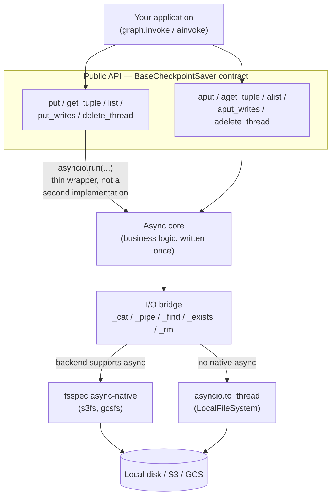
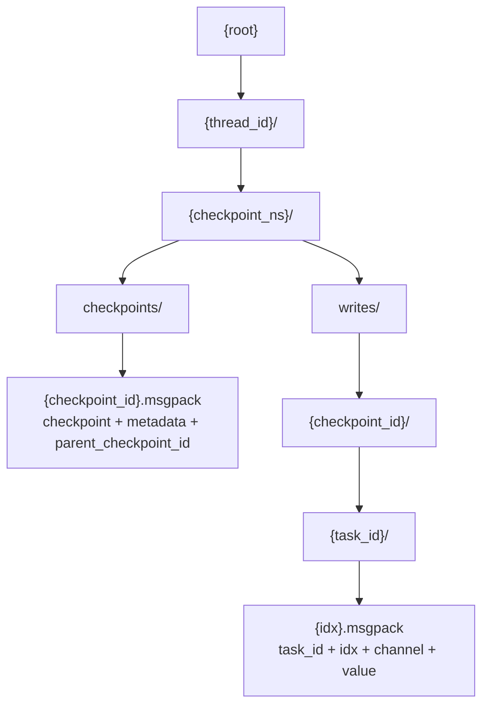

# langgraph-checkpoint-objectstorage

[](https://github.com/sergiommarcial/langgraph-objectstorage-checkpoint/actions/workflows/ci.yml)

A [LangGraph](https://github.com/langchain-ai/langgraph) `BaseCheckpointSaver`
that persists checkpoints to local filesystem, Google Cloud Storage, or AWS
S3. One class, backend picked by connection string, nothing to run beyond a
bucket (or a directory).

## Table of contents

- [Features](#features)
- [Requirements](#requirements)
- [Install](#install)
- [Quickstart](#quickstart)
- [Examples](#examples)
- [Choosing a backend](#choosing-a-backend)
- [Architecture](#architecture)
- [Runtime type checking](#runtime-type-checking)
- [Logging](#logging)
- [Known limitations](#known-limitations)
- [Development](#development)
- [Contributing](#contributing)
- [License](#license)

## Features

- `ObjectStorageSaver.from_conn_string(...)` picks local disk, GCS, or S3
  from the URI scheme. No per-backend subclasses.
- Full sync and async support: every `BaseCheckpointSaver` method, both
  flavors (`get_tuple`/`aget_tuple`, `put`/`aput`, `list`/`alist`,
  `put_writes`/`aput_writes`, `delete_thread`/`adelete_thread`).
- Tested against the official contract with
  [`langgraph-checkpoint-conformance`](https://pypi.org/project/langgraph-checkpoint-conformance/)
  on all three backends, not just hand-written assertions.
- Runtime type checking on the public API via
  [typeguard](https://typeguard.readthedocs.io/) catches wrong-argument-type
  mistakes at the call site.
- Ships `py.typed` for full static type coverage under mypy/pyright.
- No database or extra service required in production, just object storage.

## Requirements

Python 3.11+.

## Install

```bash
pip install langgraph-checkpoint-objectstorage        # local filesystem only
pip install "langgraph-checkpoint-objectstorage[s3]"   # + AWS S3
pip install "langgraph-checkpoint-objectstorage[gcs]"  # + Google Cloud Storage
```

## Quickstart

```python
from langgraph.graph import END, START, StateGraph
from langgraph_checkpoint_objectstorage import ObjectStorageSaver


def increment(state: dict) -> dict:
    return {"count": state["count"] + 1}


builder = StateGraph(dict)
builder.add_node("increment", increment)
builder.add_edge(START, "increment")
builder.add_edge("increment", END)

saver = ObjectStorageSaver.from_conn_string("file:///tmp/checkpoints")
graph = builder.compile(checkpointer=saver)

config = {"configurable": {"thread_id": "1"}}
result = graph.invoke({"count": 0}, config)
print(result)  # {"count": 1}

# Checkpoints persisted under the thread survive process restarts --
# inspect or resume from the same thread_id at any later point:
history = list(graph.get_state_history(config))
```

## Examples

This same quickstart, runnable under three build tools:

- [`examples/pip`](examples/pip): venv + `pip install -r requirements.txt`
- [`examples/uv/filesystem`](examples/uv/filesystem): `uv run main.py`
- [`examples/poetry/filesystem`](examples/poetry/filesystem): `poetry install && poetry run python main.py`

Each installs the package from this repo via a local path dependency
(swap for a normal PyPI dependency once the package is published).

Further along, against object storage instead of local disk (real bucket
or a local emulator, no cloud account needed): multiple independent
sessions run sequentially and one is resumed later, plus the same pattern
run concurrently via the async API, for both S3 and GCS:

- [`examples/uv/s3`](examples/uv/s3) / [`examples/uv/s3-async`](examples/uv/s3-async)
- [`examples/poetry/gcs`](examples/poetry/gcs) / [`examples/poetry/gcs-async`](examples/poetry/gcs-async)

Sequential and concurrent are separate examples rather than one combined
script, see [Known limitations](#known-limitations) for why.

## Choosing a backend

Swap the connection string; everything else stays the same.

```python
from langgraph_checkpoint_objectstorage import ObjectStorageSaver

# Local filesystem -- handy for development, or single-node deployments
saver = ObjectStorageSaver.from_conn_string("file:///var/lib/my-app/checkpoints")

# Google Cloud Storage
saver = ObjectStorageSaver.from_conn_string("gcs://my-bucket/checkpoints")

# AWS S3
saver = ObjectStorageSaver.from_conn_string("s3://my-bucket/checkpoints")
```

`from_conn_string` forwards extra keyword arguments to the underlying
[fsspec](https://filesystem-spec.readthedocs.io/) filesystem constructor.
Useful for explicit credentials, non-default regions, or S3-compatible
endpoints (MinIO, Cloudflare R2, etc.):

```python
saver = ObjectStorageSaver.from_conn_string(
    "s3://my-bucket/checkpoints",
    key="...",
    secret="...",
    client_kwargs={"endpoint_url": "https://minio.internal:9000"},
)
```

Credentials otherwise follow each backend's normal resolution: AWS's usual
chain (env vars, `~/.aws/credentials`, instance/task role) for S3,
Application Default Credentials for GCS. Nothing library-specific to
configure beyond the connection string.

## Architecture

Business logic (key layout, filtering, ordering, idempotency) is written
once, as async methods. The public sync API is a thin `asyncio.run(...)`
wrapper around that same async core, not a second implementation, so
there's a single source of truth per operation instead of sync and async
code drifting apart. An I/O bridge picks native async calls when the
backend supports them (`s3fs`, `gcsfs`) and falls back to
`asyncio.to_thread` when it doesn't (local disk):



Each checkpoint and each write becomes its own object: no read-modify-write
on existing keys, so concurrent writers on different threads never race,
and a `put` or `put_writes` call is always a single write:



Key technical decisions this reflects:

- `checkpoint_id` is LangGraph's own [uuid6](https://github.com/langchain-ai/langgraph/blob/main/libs/checkpoint/langgraph/checkpoint/base/id.py),
  already time-sortable, so `list()`'s newest-first ordering falls out of a
  plain key sort, with no secondary index to keep in sync.
- Checkpoints and metadata are serialized through LangGraph's own
  `JsonPlusSerializer` and treated as opaque: never hand-extracted field by
  field, since real LangGraph objects carry fields their own TypedDicts
  don't declare (see [Runtime type checking](#runtime-type-checking)).
- `put_writes`' overwrite-vs-ignore split ("first write wins" for regular
  channels, always-replace for the control channels `ERROR`/`SCHEDULED`/
  `INTERRUPT`/`RESUME`) mirrors the official sqlite/postgres savers exactly.
- `list(filter=...)` is deliberately client-side, not an oversight: object
  storage has no query engine to push a filter into. See
  [Known limitations](#known-limitations).

## Runtime type checking

Public methods are decorated with [typeguard](https://typeguard.readthedocs.io/)
and raise `typeguard.TypeCheckError` on a call with the wrong argument
types (e.g. a non-string `thread_id`, a `writes` argument that isn't a
sequence of `(channel, value)` pairs). This catches integration mistakes
at the call site instead of letting them corrupt stored data silently.

`config`, `checkpoint`, and `metadata` arguments are intentionally *not*
strictly checked against LangGraph's `RunnableConfig`/`Checkpoint`/
`CheckpointMetadata` TypedDicts: real LangGraph objects don't match those
TypedDicts exactly (a real `RunnableConfig`'s `metadata` field is a
`collections.ChainMap`, not a plain `dict`; real checkpoints carry fields
like the legacy `pending_sends` key that isn't declared at all), and strict
checking would reject every real invocation. Same reasoning applies to
`get_tuple`/`list`'s return value, which isn't runtime-checked for the same
reason. Other arguments (`thread_id`, `task_id`, `writes`, `limit`, ...)
are checked normally.

## Logging

Uses standard `logging` under the logger name
`langgraph_checkpoint_objectstorage`. No handlers are configured, so it
stays silent until your application's logging config says otherwise.

For quick debugging, set `LANGGRAPH_CHECKPOINT_OBJECTSTORAGE_LOG_LEVEL=DEBUG`
before constructing an `ObjectStorageSaver`. It emits one DEBUG line per
storage read/write/list with the key or prefix touched.

## Known limitations

- `list(filter=...)` is client-side: every checkpoint in the thread/namespace
  is fetched and filtered in Python, since object storage has no query
  engine to push the filter into. Fine for typical thread histories (dozens
  to low hundreds of checkpoints); a very long-running thread's `list` calls
  will get proportionally slower.
- No garbage collection or retention policy. Old checkpoints accumulate
  until you call `delete_thread`, or you set up bucket lifecycle rules
  yourself.
- Two writers on the *same* `thread_id` writing concurrently can race, at
  the same guarantee level as the official sqlite saver (last write "wins"
  by whichever checkpoint_id sorts last, not by wall-clock order under
  clock skew). Concurrent writers on different threads never race.
- The sync `list()` eagerly collects all matching checkpoints before
  yielding the first one (it wraps the async implementation via
  `asyncio.run`, which can't stream lazily). Use `alist()` from async code
  if you need true streaming.
- Don't mix sync and async calls on the *same* `ObjectStorageSaver`
  instance against S3 or GCS. Sync calls run on a persistent background
  loop the underlying filesystem maintains; async calls run on whichever
  loop the caller provides. The aiohttp session those backends use can
  only belong to one loop at a time, so alternating between the two on
  one instance breaks with `RuntimeError: ... attached to a different
  loop`. Build a separate saver instance per usage style instead (see
  `examples/uv/s3` vs `examples/uv/s3-async`, or `examples/poetry/gcs` vs
  `examples/poetry/gcs-async`). Local filesystem isn't affected: it has no
  persistent session to misalign.

## Development

```bash
make install        # sync deps into an isolated .venv (installs uv if missing)
make lint             # black --check, pyflakes, bandit, vulture -- runs before test/build
make format          # apply black formatting in place
make test            # full suite -- docker-compose integration tests auto-skip if not up
make test-unit        # tests/unit only -- no external services, fast
make test-integration  # tests/integration -- starts docker-compose emulators first
```

`test`/`test-unit`/`test-integration`/`build` all run `lint` first, so a
formatting or static-analysis failure blocks the run rather than
surfacing only after tests pass. `bandit`/`vulture` are scoped to `src/`
only: `bandit` flags every pytest `assert` and the tests' intentionally
fake credentials, and `vulture` can't see that `ObjectStorageSaver`'s
public methods are called by library consumers rather than this codebase
(see `vulture_whitelist.py`).

Or without `make`, directly via `uv`:

```bash
uv sync --all-extras --group dev
uv run pytest
```

Test layout: `tests/unit/` exercises internal modules (key layout,
serialization, the saver's core logic, logging, type checking) with no
external service. `tests/integration/` validates the full
`BaseCheckpointSaver` contract via
[`langgraph-checkpoint-conformance`](https://pypi.org/project/langgraph-checkpoint-conformance/)
against real backends: local disk, an in-process moto server for S3, and
(via `docker-compose.yaml`) `fake-gcs-server`/`moto-server` containers for a
full local GCS/S3 round-trip with no cloud account needed. A gated test
against a real GCS bucket runs only when `GCS_TEST_BUCKET` is set.

```bash
make compose-up      # start local S3/GCS emulators
make test-integration
make compose-down     # stop them when done
```

## Contributing

Issues and PRs welcome. Before opening one, `make test` should pass
(`make test-integration` too, if your change touches backend I/O). CI runs
lint, unit tests (Python 3.11/3.12/3.13), and integration tests against
docker-compose emulators on every push and PR.

Add an entry under `## [Unreleased]` in [`CHANGELOG.md`](CHANGELOG.md) for
any user-facing change. On merge to `main`, CI moves that section into a
new dated version automatically (see the `release` job in
`.github/workflows/ci.yml`). An empty `[Unreleased]` just gets a generic
placeholder line instead, so it's worth taking the extra minute.

## License

[MIT](LICENSE).

