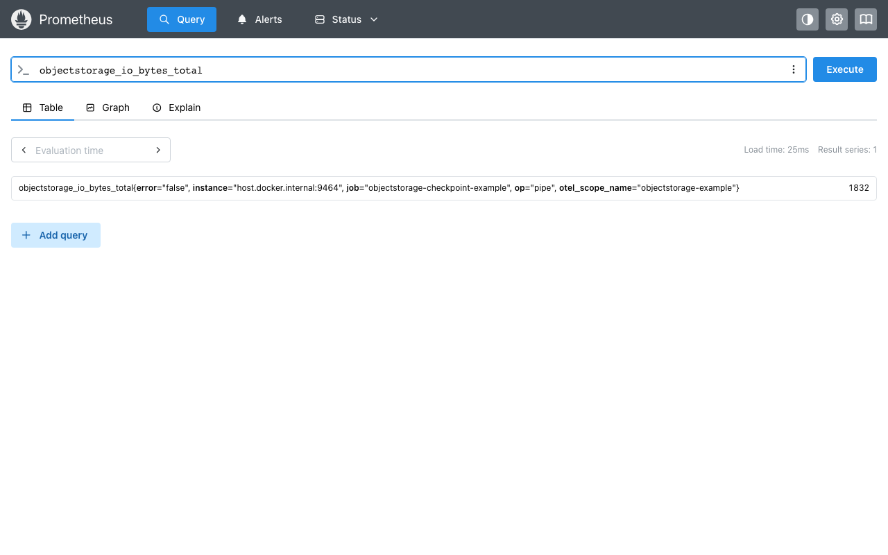
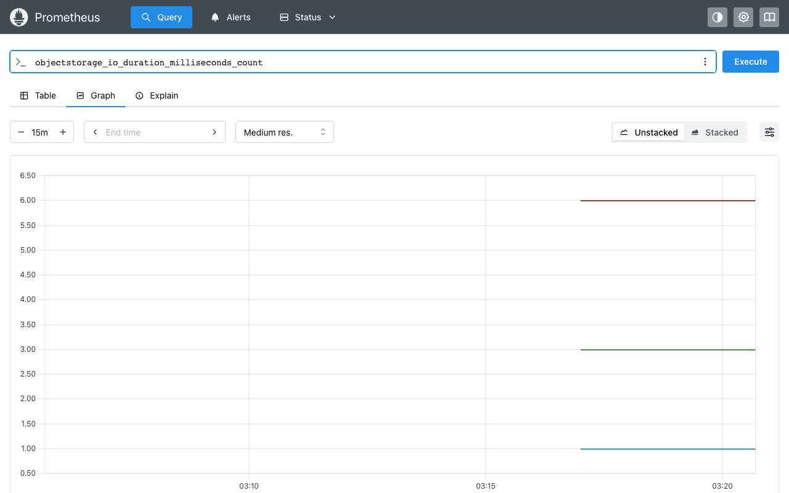

# uv + compression + encryption + observability example

Configures one saver with `compression="zstd"`, `encryption=<KeyProvider>`,
and `on_io=otel_on_io_adapter(tracer, meter=...)` all together, to show
they compose. The adapter's metrics go to a real Prometheus, scraped over
Docker from a `prometheus_client` endpoint this script serves.

```bash
uv run main.py     # runs the graph, then serves metrics on :9464 until Ctrl+C
docker compose up -d   # in another terminal: starts Prometheus, scrapes :9464
```

Then open http://localhost:9090/query and query
`objectstorage_io_bytes_total` (table view) to see the real, on-wire byte
count for each op -- 1832 bytes here, the `pipe` call that wrote the
compressed+encrypted checkpoint object:



Or `objectstorage_io_duration_milliseconds_count` (graph view) to see call
counts per op (`find`/`exists`/`pipe`) over time:



```bash
docker compose down   # when done
```
